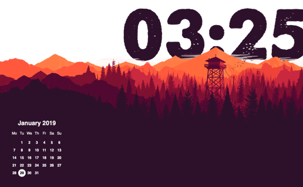

# An Übersicht calendar widget using ES6 syntax and css grid.

## Settings

- Set the day of the week to start your Calendar by setting the calendarStartDay variable. 0 for Sunday, 1 for Monday etc. (line 8).
- Update widget screen position by adjusting the className css properties (line 15).

---

## Screenshot

---

